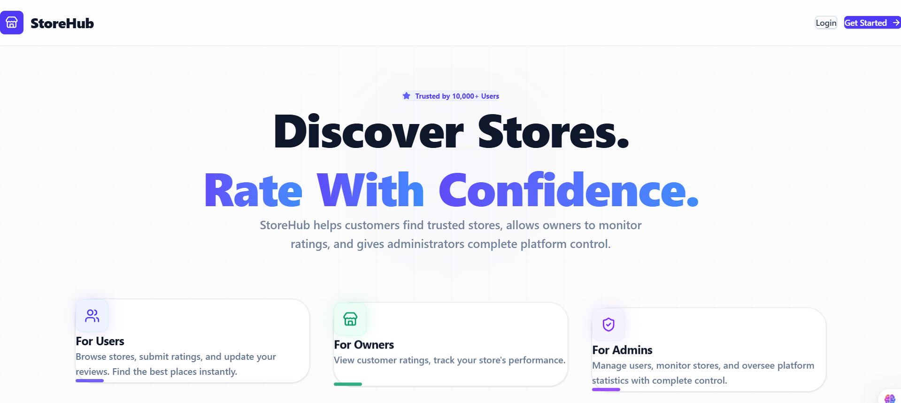
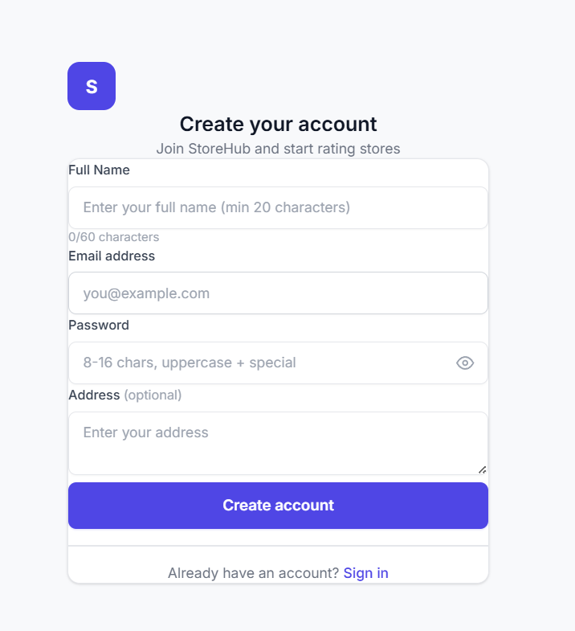
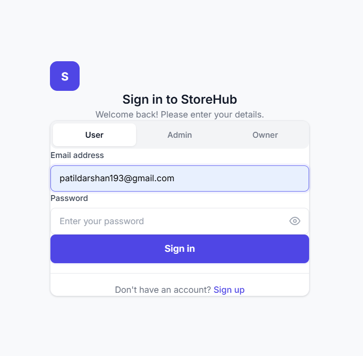
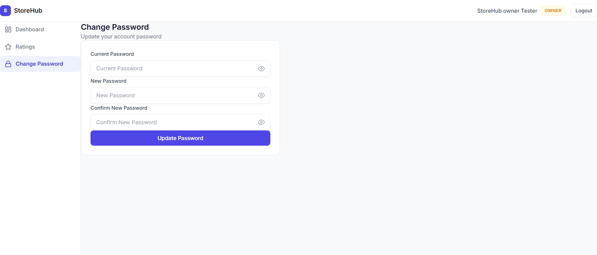
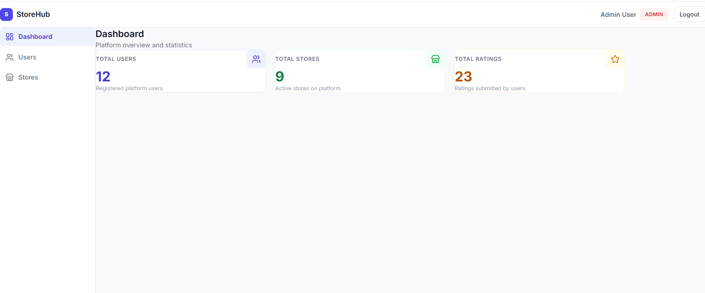
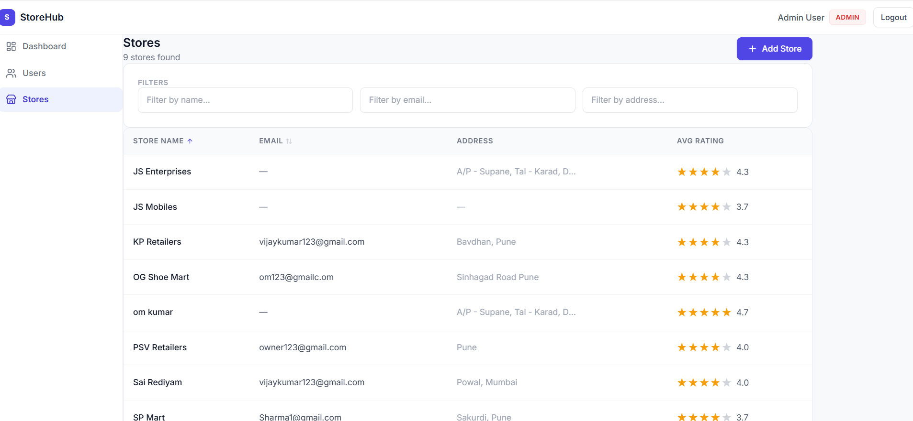
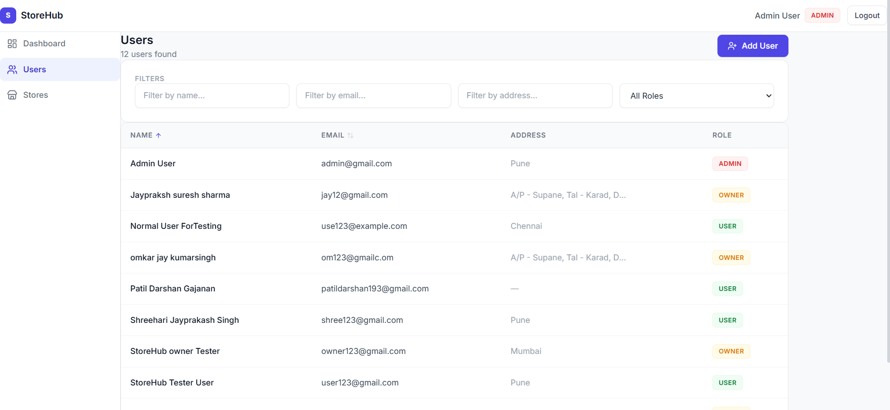
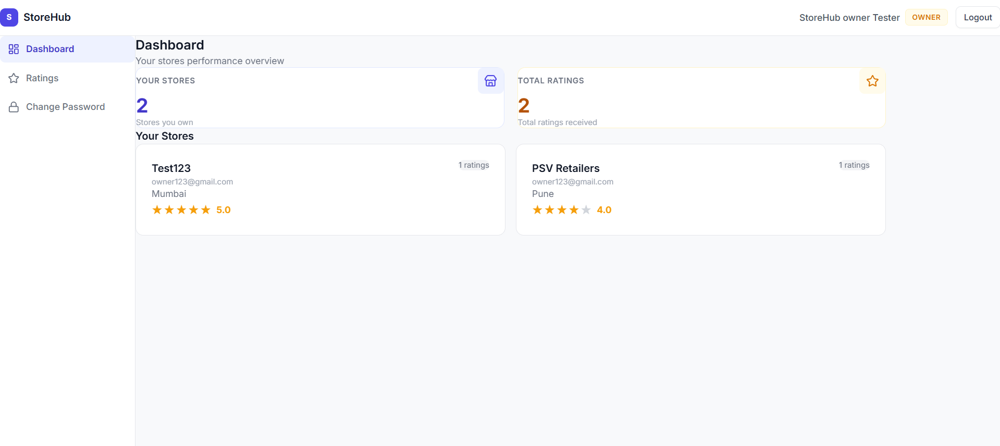
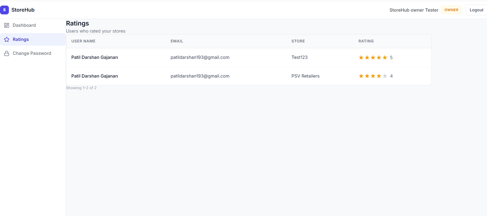
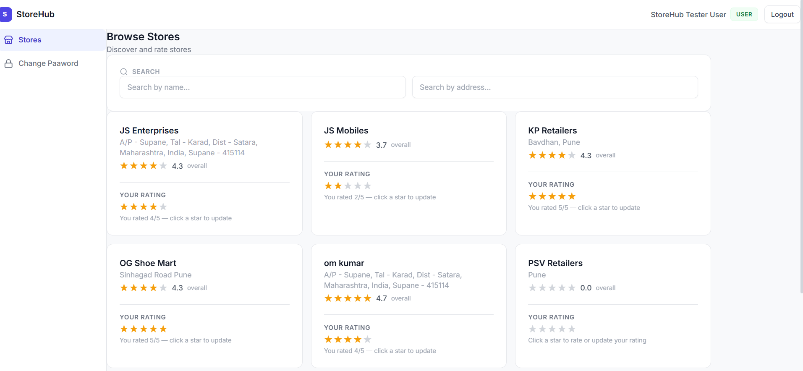

# StoreHub - FullStack Store Rating Platform

StoreHub is a responsive web application that allows users to discover businesses, submit ratings, and provides store owners and system administrators with powerful tools to manage and track platform analytics.

Built with **React (Vite), Tailwind CSS, Express.js, and MySQL**.

---

## 📸 Application Screenshots

### Home Page & Authentication





### Admin View




### Store Owner View



### User View


---

## 🚀 How to Run & Test the Application

### 1. Backend Setup
1. Open a terminal and navigate to the `backend` folder: `cd backend`
2. Install dependencies: `npm install`
3. Configure your `.env` file with your MySQL database credentials and JWT secret.
4. **Initial Database Setup (Optional but Recommended):** Populate the database with default users, admins, owners, and stores by running the seed script:
   ```bash
   node seed.js
   ```
5. Start the server: `npm start` (Runs on port 5000 by default)

> [!NOTE]  
> *Admin Privileges:* The `seed.js` script automatically generates an Admin account (`admin@gmail.com`). You can log in using this seeded Admin account to manually add additional Stores, Owners, and Users one by one through the Admin Dashboard.

### 2. Frontend Setup
1. Open a new terminal and navigate to the `frontend` folder: `cd frontend`
2. Install dependencies: `npm install`
3. Start the Vite development server: `npm run dev`
4. Open your browser and navigate to the URL provided (usually `http://localhost:5173`)

---

## Test Credentials

To quickly test the application's role-based features without registering new accounts, you can use the following pre-configured credentials:

### 1. Normal User
- **Email:** `user123@gmail.com`
- **Password:** `User123@gmailcom`

### 2. Store Owner
- **Email:** `owner123@gmail.com`
- **Password:** `Owner123@gmail.`

### 3. System Administrator/Admin
- **Email:** `admin@gmail.com`
- **Password:** `Admin@123`

---

## ✨ Features by User Role

StoreHub enforces strict role-based access control (RBAC), providing tailored dashboards and functionalities for different types of users:

### Admin
- **Platform Management:** Add new stores, normal users, and admin users directly from the dashboard.
- **Analytics Dashboard:** View real-time statistics displaying the total number of users, stores, and submitted ratings.
- **Store Directory:** View a comprehensive list of stores with their Name, Email, Address, and Average Rating.
- **User Management:** View a list of all normal users, owners, and admins.
- **Advanced Filtering:** Apply dynamic filters on listings based on Name, Email, Address, and Role.
- **Detailed Profiles:** View deep details of all users (including viewing a Store Owner's specific ratings).

### Normal User
- **Authentication:** Securely sign up, log in, and update passwords.
- **Discover Stores:** View a complete directory of all registered stores on the platform.
- **Search:** Quickly search for specific stores by Name and Address.
- **Interactive Ratings:** View a store's overall average rating alongside your own submitted rating.
- **Submit/Modify Feedback:** Easily submit new ratings (1 to 5 stars) or modify existing ratings for individual stores.

### Store Owner
- **Authentication:** Secure login and password management.
- **Owner Dashboard:** Access a dedicated dashboard showing the performance of their owned stores.
- **Customer Insights:** View a detailed list of users who have submitted ratings for their specific store.
- **Performance Tracking:** Monitor the average rating and total feedback count for their store.

---

## Form Validations & Security
- **Name:** Minimum 20 characters, Maximum 60 characters.
- **Address:** Maximum 400 characters.
- **Password:** 8-16 characters, must include at least one uppercase letter and one special character.
- **Email:** Strict standard email validation.
- **Data Tables:** All tabular data supports ascending/descending sorting for seamless navigation.
